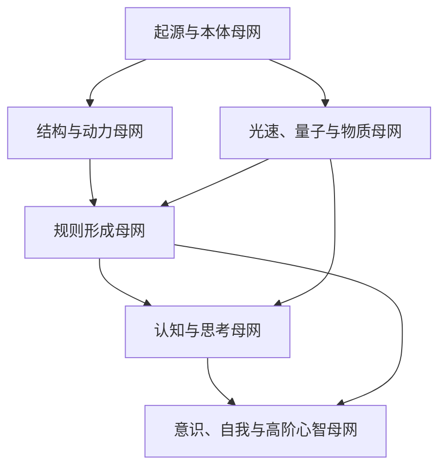

# 核心理论网络图谱：三十六个核心理论网

## 说明

这份文稿用于把当前已经形成的多份研究材料进一步压缩、贯通和系统化，目标不是再增加零散观点，而是建立一个可持续扩展的“理论网络图谱”。这里所说的“理论网”，不是指 36 个彼此完全独立的新理论，而是指 36 个能够稳定承载研究问题、相互连边、可继续深化的核心理论节点。

为了避免概念膨胀，这份图谱采用三类标签：

- `S`：标准支持网
  主要由现有物理学、宇宙学、认知科学或复杂系统研究直接支持。
- `B`：桥接整合网
  主要用于把不同层级理论接通，属于解释性强、可继续模型化的中间网络。
- `H`：研究假说网
  目前更适合当作研究程序、统一解释或哲学扩展，尚不能直接当作既定定律。

## 一、总目标

这份图谱试图完成四件事：

1. 把“力的落差与宇宙非均匀演化”从单一主张扩展为分层网络体系。
2. 把物理结构形成、规则稳定、认知生成和意识组织贯通成一条连续链。
3. 把已有的散点材料压缩成可以继续扩写、案例化和模型化的核心节点。
4. 为后续的论文、专著或开源图谱提供稳定框架。

## 二、六个母网

当前整套理论可先压缩成六个母网：

1. `起源与本体母网`
2. `结构与动力母网`
3. `规则形成母网`
4. `光速、量子与物质母网`
5. `认知与思考母网`
6. `意识、自我与高阶心智母网`

这六个母网之间的关系可概括为：

这个图的含义是：

- 起源层提供最初差异与可能空间；
- 动力层解释结构如何生成；
- 规则层解释稳定关系如何析出；
- 量子与相对论层给出物质与因果边界；
- 认知层解释思考如何作为高层系统出现；
- 意识层解释系统如何对自身进行全局整合和叙述。

## 三、三十六个核心理论网

以下 36 个核心理论网，按照六个母网展开。

---

## 母网一：起源与本体母网

### 网01 非均匀起源网 `S/B`

- 核心定义：
  世界中大尺度结构的出现以某种初始差异、不均匀或涨落为前提。
- 核心命题：
  绝对均匀状态不利于产生可持续结构；微小初始差异可成为后续放大的种子。
- 主要连接：
  连接网02、网07、网19。
- 当前地位：
  在宇宙学层面有强支持，在一般本体层面属于桥接解释。

### 网02 梯度与落差网 `B`

- 核心定义：
  系统中的变化率、势差、密度差、能量差和方向差，是结构驱动的统一语言。
- 核心命题：
  “力的落差”可以被严格化为场的非均匀性与尺度上的差异。
- 主要连接：
  连接网07、网08、网13、网14。
- 当前地位：
  作为统一描述语言有价值，但不宜直接宣称为新基本量。

### 网03 因果边界网 `S/B`

- 核心定义：
  任一规则都必须建立在“谁能影响谁”的因果边界之上。
- 核心命题：
  有限传播速度、时空锥和局域性为对象边界和规则层级提供前提。
- 主要连接：
  连接网19、网20、网23。
- 当前地位：
  相对论层面属标准支持，扩展到“规则边界”属于桥接整合。

### 网04 对称性与不变量网 `S`

- 核心定义：
  对称性决定哪些量在演化中被强制保留。
- 核心命题：
  规则稳定的深层来源之一，是存在不变量和守恒量。
- 主要连接：
  连接网10、网13、网15、网16。
- 当前地位：
  标准理论核心节点。

### 网05 多尺度时间网 `B`

- 核心定义：
  不同层级现象拥有不同演化速度和时间窗口。
- 核心命题：
  世界的规则并非只在一个时间尺度上成立，而是层级化地展开。
- 主要连接：
  连接网11、网14、网25、网31。
- 当前地位：
  复杂系统和认知科学中非常重要，作为总体系桥接节点尤其关键。

### 网06 初始条件与可能性网 `H/B`

- 核心定义：
  可能性不是无限漂浮的抽象集合，而是受初始条件和可达路径约束的空间。
- 核心命题：
  所谓“无限可能”应被理解为在规则边界内的条件性可达集合。
- 主要连接：
  连接网01、网18、网29、网36。
- 当前地位：
  属于桥接与哲学扩展节点。

---

## 母网二：结构与动力母网

### 网07 力矩与旋转生成网 `S`

- 核心定义：
  非均匀外场与扩展体内部结构耦合，可产生净力矩和角动量积累。
- 核心命题：
  旋转不是凭空出现，而是结构与梯度共同作用的结果。
- 主要连接：
  连接网02、网08、网16。
- 当前地位：
  经典力学层面有直接支持。

### 网08 涡量与漩涡结构网 `S`

- 核心定义：
  流体与连续介质中的旋涡由剪切、斜压项、外力旋度等机制生成。
- 核心命题：
  涡旋是非均匀性进入具体动力学后的结构化结果。
- 主要连接：
  连接网02、网07、网09、网17。
- 当前地位：
  流体动力学标准支持节点。

### 网09 吸引子与稳定区网 `B`

- 核心定义：
  复杂系统会在状态空间中形成相对稳定的吸引区。
- 核心命题：
  结构之所以持续，不只是因为生成过，而是因为存在稳定盆地。
- 主要连接：
  连接网11、网16、网27、网32。
- 当前地位：
  是从物理结构向认知结构过渡的关键桥接网。

### 网10 相变与对称破缺网 `S/B`

- 核心定义：
  当控制参数越过阈值，系统可能从高对称状态转入低对称但更稳定的结构。
- 核心命题：
  新规则常常不是“突然外加”，而是对称性破缺后的新稳定态。
- 主要连接：
  连接网04、网16、网18、网22。
- 当前地位：
  物质与规则形成层面都极其重要。

### 网11 开放系统与耗散网 `S/B`

- 核心定义：
  真实系统通常不是闭合的，而是与环境交换能量、物质与信息。
- 核心命题：
  很多稳定结构不是隔离中形成，而是在耗散与交换中维持。
- 主要连接：
  连接网09、网17、网22、网27。
- 当前地位：
  从非平衡物理到认知系统都具有强解释力。

### 网12 阈值跃迁网 `B`

- 核心定义：
  系统输出常不是线性连续增长，而是跨过阈值后突然转入新状态。
- 核心命题：
  顿悟、相变、决断、结构塌缩等都可视为阈值跃迁的不同形态。
- 主要连接：
  连接网10、网28、网31、网34。
- 当前地位：
  属于横跨物理、认知和意识层的高价值桥接网。

---

## 母网三：规则形成母网

### 网13 规则定义网 `B`

- 核心定义：
  规则是变量间可重复、可压缩、可稳定、可扰动维持的关系。
- 核心命题：
  规则不应被理解为先验文本，而应被理解为稳定析出的结构关系。
- 主要连接：
  连接网14、网15、网18。
- 当前地位：
  是全书理论语言的核心节点。

### 网14 粗粒化映射网 `S/B`

- 核心定义：
  复杂微观状态可通过粗粒化映射到较低维的宏观有效状态空间。
- 核心命题：
  没有粗粒化，就没有宏观规则可言。
- 主要连接：
  连接网05、网13、网15、网17。
- 当前地位：
  标准统计物理和复杂系统理论的重要支撑。

### 网15 有效理论网 `S/B`

- 核心定义：
  每一尺度上都有自己的有效描述，不需要总退回最底层变量。
- 核心命题：
  高层规则不是虚假的，只要它在该尺度上具有稳定预测力。
- 主要连接：
  连接网13、网14、网22、网27、网31。
- 当前地位：
  整套研究贯通多学科的关键方法网。

### 网16 稳定对象网 `B`

- 核心定义：
  对象不是物质堆积的名字，而是可在演化中长期维持的稳定模式。
- 核心命题：
  对象的本质是关键变量的封闭、恢复与可识别性。
- 主要连接：
  连接网07、网10、网20、网21、网24。
- 当前地位：
  物体、生命体和自我模型都可在此网下被统一理解。

### 网17 信息压缩网 `B`

- 核心定义：
  规则的可理解性和可使用性，依赖系统能把复杂性压缩成较少变量。
- 核心命题：
  没有压缩，就只有杂乱过程；有了压缩，规则才变得可见。
- 主要连接：
  连接网08、网11、网14、网26、网33。
- 当前地位：
  是从宏观物理走向认知的桥梁之一。

### 网18 反馈与校正网 `S/B`

- 核心定义：
  系统通过比较当前状态与目标或预测结果，不断调整自身。
- 核心命题：
  很多稳定结构都不是静止得来，而是持续校正得来。
- 主要连接：
  连接网06、网10、网13、网25、网28、网35。
- 当前地位：
  从控制论到认知都具普适价值。

---

## 母网四：光速、量子与物质母网

### 网19 光速与因果常数网 `S`

- 核心定义：
  真空中的 $c$ 是时空因果结构常数。
- 核心命题：
  光速不是“光的偶然速度”，而是规则分层与局域因果的边界。
- 主要连接：
  连接网03、网20、网23。
- 当前地位：
  相对论标准核心节点。

### 网20 量子状态网 `S`

- 核心定义：
  微观系统用态矢量或密度矩阵而非经典轨迹描述。
- 核心命题：
  稳定物质和微观行为必须经过量子约束来理解。
- 主要连接：
  连接网16、网21、网22。
- 当前地位：
  量子理论基础节点。

### 网21 测量与概率输出网 `S/B`

- 核心定义：
  量子测量通过概率分布把可能态连接到观测结果。
- 核心命题：
  规则不总体现为单次确定值，也可体现为稳定统计结构。
- 主要连接：
  连接网20、网22、网30。
- 当前地位：
  量子理论支撑下，也与认知概率输出有桥接意义。

### 网22 退相干与经典化网 `S/B`

- 核心定义：
  开放量子系统与环境耦合，使某些表征基底中的相干项衰减。
- 核心命题：
  宏观经典对象不是对量子的背离，而是量子系统在环境中的稳定极限。
- 主要连接：
  连接网10、网11、网15、网20、网24。
- 当前地位：
  是连接量子层与宏观层的重要桥梁。

### 网23 相对论量子场统一网 `S`

- 核心定义：
  基本对象更适合被理解为时空中的量子场及其激发。
- 核心命题：
  因果结构与量子规则并不是彼此排斥，而是在场论中共同被组织。
- 主要连接：
  连接网03、网19、网20。
- 当前地位：
  微观理论中最高稳定层之一。

### 网24 量子-认知边界网 `B/H`

- 核心定义：
  认知系统由量子物质构成，但其高层有效规则不必等于量子相干过程。
- 核心命题：
  “建立在量子物质之上”与“就是量子力学本身”必须区分。
- 主要连接：
  连接网16、网22、网27、网31。
- 当前地位：
  是处理量子与思考关系时最关键的边界节点。

---

## 母网五：认知与思考母网

### 网25 感知-预测网 `B`

- 核心定义：
  认知并非被动接收输入，而是不断生成预测并校正误差。
- 核心命题：
  感知本身就是生成模型与现实输入之间的比较过程。
- 主要连接：
  连接网18、网26、网27、网35。
- 当前地位：
  是解释思考、知觉和学习的核心认知网。

### 网26 记忆-表征网 `B`

- 核心定义：
  记忆为系统提供可压缩的稳定基底，表征则为思考提供操作对象。
- 核心命题：
  没有表征基底，就没有真正的想象、类比和推理。
- 主要连接：
  连接网17、网25、网29、网32。
- 当前地位：
  认知体系的支撑节点。

### 网27 思考动力学网 `B`

- 核心定义：
  思考是认知状态空间中的开放动力学。
- 核心命题：
  所谓思考“力学”，更接近吸引子、阻尼、竞争、噪声与阈值共同构成的高层动力学。
- 主要连接：
  连接网09、网11、网24、网28、网31。
- 当前地位：
  是认知层的总枢纽之一。

### 网28 决策-证据积累网 `S/B`

- 核心定义：
  决策通常由证据、偏置和噪声在时间上累积到阈值而形成。
- 核心命题：
  “决定”多半不是瞬时降临，而是累积到边界后的跃迁。
- 主要连接：
  连接网12、网18、网27、网30、网35。
- 当前地位：
  漂移扩散模型等已有强支撑，是连接认知和行为的重要节点。

### 网29 想象-反事实网 `B/H`

- 核心定义：
  系统可在内部表征空间中模拟未发生之事和未见之物。
- 核心命题：
  想象的自由首先是表征与组合自由，而不是对现实因果的脱法。
- 主要连接：
  连接网06、网26、网36。
- 当前地位：
  认知与哲学交界的高价值桥接节点。

### 网30 认知惯性与偏差网 `S/B`

- 核心定义：
  有限资源、先验偏置、情绪权重和社会影响，使认知系统产生系统性偏差。
- 核心命题：
  错误推理不是纯噪声，而是有限系统的结构代价。
- 主要连接：
  连接网21、网28、网33、网35。
- 当前地位：
  在认知科学和行为研究中高度重要。

---

## 母网六：意识、自我与高阶心智母网

### 网31 全局工作空间网 `B`

- 核心定义：
  某些内容一旦进入全局可访问空间，就获得显性意识地位。
- 核心命题：
  意识首先可被理解为“被点亮并可广播”的整合状态。
- 主要连接：
  连接网05、网12、网24、网27、网32。
- 当前地位：
  是当前解释意识结构最有组织力的节点之一。

### 网32 自我模型网 `B`

- 核心定义：
  自我不是隐藏实体，而是系统整合身体、记忆、目标和社会身份的高稳定模型。
- 核心命题：
  “我”更像一个持续更新的模型，而不是不可分实体。
- 主要连接：
  连接网09、网26、网31、网35、网36。
- 当前地位：
  是从认知到意识的关键桥接节点。

### 网33 直觉压缩网 `B`

- 核心定义：
  直觉是经验压缩后的快速推断机制。
- 核心命题：
  直觉并非无规则，而是复杂统计规律的高压缩近似执行。
- 主要连接：
  连接网17、网30、网34。
- 当前地位：
  可与专业判断、熟练技能和模式识别研究相连。

### 网34 灵感重组网 `B/H`

- 核心定义：
  灵感是远距联想和新组合跨过意识阈值的时刻。
- 核心命题：
  灵感不是无中生有，而是内部搜索在某时刻完成重组。
- 主要连接：
  连接网12、网29、网31、网33。
- 当前地位：
  解释力强，但仍需更多案例和模型支撑。

### 网35 价值-情绪加权网 `B`

- 核心定义：
  情绪不是思考之外的污染，而是价值系统对信息流的加权机制。
- 核心命题：
  很多决策和注意分配，本质上都受价值张力和情绪权重调制。
- 主要连接：
  连接网18、网25、网28、网30、网32。
- 当前地位：
  是把理性和情绪统一起来的重要网络。

### 网36 意识叙事与意义网 `H/B`

- 核心定义：
  高阶心智不只处理信息，还会把信息组织成关于自我、世界和可能性的叙事。
- 核心命题：
  意义并非纯主观附属物，而是高层系统维持行动连续性和世界可理解性的叙事组织形式。
- 主要连接：
  连接网06、网29、网32、网34。
- 当前地位：
  处于认知科学、人文哲学和价值理论的交界处。

## 四、十条贯通总链

为了避免 36 个理论网再次分散，下面给出 10 条贯通链。

### 总链1 起源链

网01 → 网02 → 网07 → 网16

含义：
从初始差异出发，经由梯度与力矩机制，形成稳定对象。

### 总链2 宇宙结构链

网01 → 网03 → 网19 → 网23 → 网22

含义：
从起源差异到因果边界，再到相对论量子场与宏观经典化，给出宇宙物质组织的大框架。

### 总链3 规则生成链

网04 → 网10 → 网13 → 网14 → 网15

含义：
从对称性和相变出发，经由规则定义、粗粒化和有效理论，形成层级规则。

### 总链4 对象稳定链

网11 → 网16 → 网17 → 网18

含义：
开放系统中的对象之所以能持续，依赖压缩与反馈校正。

### 总链5 量子-宏观链

网20 → 网21 → 网22 → 网24

含义：
量子概率输出通过退相干走向宏观稳定，同时为认知边界提供底层背景。

### 总链6 认知生成链

网25 → 网26 → 网27 → 网28

含义：
从预测性感知到表征记忆，再到思考动力学和决策累积。

### 总链7 想象链

网26 → 网29 → 网34 → 网36

含义：
从表征基底到反事实想象，再到灵感和意义组织。

### 总链8 偏差链

网18 → 网28 → 网30 → 网35

含义：
系统在目标和决策过程中，会因情绪和有限性而形成偏差与权重失衡。

### 总链9 意识链

网27 → 网31 → 网32 → 网36

含义：
思考动力学进入全局工作空间后，形成自我模型与叙事实践。

### 总链10 统一链

网01 → 网13 → 网27 → 网31 → 网36

含义：
从宇宙非均匀性出发，经由规则形成，最终抵达能够对规则本身进行叙述的意识系统。

## 五、十二个最值得继续深化的接口

下面列出 12 个最值得继续推进的接口，因为它们最有机会把整套体系从“解释框架”推进到“可检验研究程序”。

1. 网02 与网08：
   把“落差”语言与流体涡量、剪切张量做严格量化对接。
2. 网07 与网16：
   研究旋转生成如何进入稳定对象理论。
3. 网10 与网13：
   研究相变与新规则形成之间的严格关系。
4. 网14 与网15：
   建立不同尺度规则的系统映射。
5. 网20 与网22：
   把量子约束与宏观经典对象的形成路径写得更细。
6. 网24 与网27：
   精确界定“量子基础”与“认知有效层”的分界。
7. 网25 与网27：
   把预测误差框架和思考动力学统一成更具体模型。
8. 网27 与网28：
   把思考流和决策阈值写成联立系统。
9. 网29 与网26：
   更细解释想象为何依赖表征基底。
10. 网31 与网32：
   进一步细化意识广播如何生成稳定自我模型。
11. 网33 与网30：
   研究直觉为何高效又为何易出错。
12. 网34 与网36：
   研究灵感如何进入意义叙事和理论创造。

上述 12 个接口的第一轮系统深化，已经继续整理为《核心理论网络图谱：接口深化与三十六个二级理论网》。

## 六、这份图谱的价值

这份图谱的价值，不在于宣布“三十六个理论网都已完成证明”，而在于提供了一种更高压缩度的贯通框架。它至少完成了三件重要的事：

1. 把原本分散的文稿压缩成统一结构。
2. 把不同层级的理论关系用“节点-连边-贯通链”形式稳定下来。
3. 把后续研究的重点从“继续增加概念”转移为“继续深化接口”。

也就是说，这份图谱的作用不是替代正文，而是把正文写作、理论推进和未来案例化研究的骨架稳定下来。

## 七、结语

如果说此前的研究已经建立了一条从非均匀性到规则、从规则到认知、从认知到意识的连续主线，那么这份“三十六个核心理论网”图谱所做的事情，就是把这条主线进一步网络化。它不再把整套研究看成单线叙述，而看成一个由多个稳定节点和贯通链共同组成的理论生态。

这意味着后续研究不必再反复从头组织材料，而可以直接围绕这些核心理论网继续深化、比较、压缩、修正和扩展。只要持续坚持分层、边界和模型化推进，这个理论网络就能够继续长成一套真正更完整、更稳定、更具解释力的系统。
