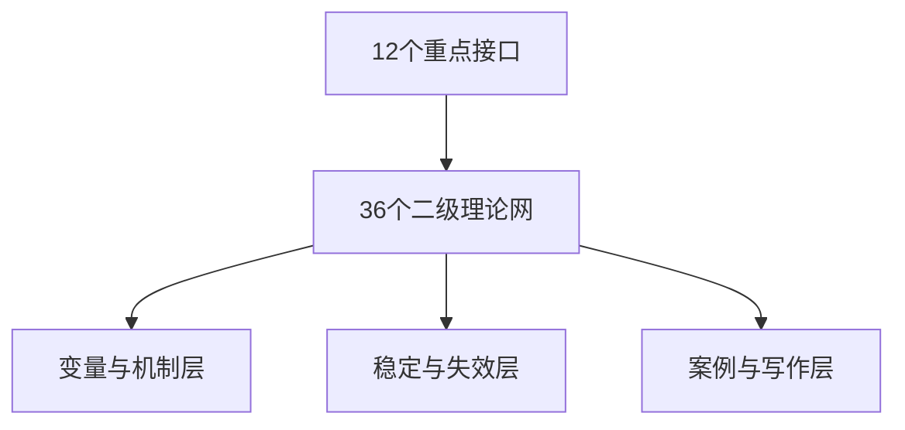

# 核心理论网络图谱：接口深化与三十六个二级理论网

## 说明

这份文稿是对《核心理论网络图谱：三十六个核心理论网》的继续深化。前一份图谱解决的是“主干节点如何搭起来”的问题；这一份文稿解决的是“主干节点之间最关键的接口如何进一步长成可研究的子网络”的问题。

这里的“二级理论网”仍然不是 36 条已经被证明的新定律，而是 36 个可继续推进的研究子程序。它们的作用有三点：

1. 把原来的接口关系从一句话变成可以继续建模的结构。
2. 把“理论贯通”进一步落实为“变量、机制、边界、失效条件”的组合。
3. 为后续长文、章节、案例、图示和公式推导提供稳定入口。

这份文稿继续采用三类标签：

- `S`：标准支持网
- `B`：桥接整合网
- `H`：研究假说网

## 一、深化原则

为了避免二级网络再次失控膨胀，这里采用四条统一原则：

1. 每个二级网都必须回答四个问题：
   它描述什么变量，它依赖什么动力学，它靠什么稳定，它在什么条件下失效。
2. 每个接口都拆成三个层面：
   `源项层`、`稳定层`、`边界层`。
3. 任何涉及物理定律的陈述，都优先写成与现有标准理论兼容的形式，而不是另起一套未经验证的基础方程。
4. 任何涉及认知与意识的陈述，都优先写成有效理论、状态空间和信息处理意义上的模型，而不是把高层现象直接还原成单个微观量。

## 二、十二个重点接口的总体分解

这 12 个接口，共拆分为 36 个二级理论网：

1. `网02 × 网08`：落差如何进入涡量与漩涡生成
2. `网07 × 网16`：旋转如何进入稳定对象理论
3. `网10 × 网13`：相变如何走向规则形成
4. `网14 × 网15`：粗粒化如何走向有效理论
5. `网20 × 网22`：量子约束如何走向宏观经典对象
6. `网24 × 网27`：量子基础与认知有效层如何分界
7. `网25 × 网27`：预测误差如何走向思考动力学
8. `网27 × 网28`：思考流如何走向决策阈值
9. `网29 × 网26`：想象为何依赖表征基底
10. `网31 × 网32`：意识广播如何走向稳定自我模型
11. `网33 × 网30`：直觉为何高效又为何易错
12. `网34 × 网36`：灵感如何进入意义叙事与理论创造

## 三、接口01：网02 × 网08
### 落差如何进入涡量与漩涡生成

`最小形式化`

$$
\boldsymbol{\omega}=\nabla\times \mathbf{v},
$$

$$
\frac{\partial \boldsymbol{\omega}}{\partial t}
=
\nabla\times(\mathbf{v}\times\boldsymbol{\omega})
+\frac{\nabla\rho\times\nabla p}{\rho^2}
+\nu\nabla^2\boldsymbol{\omega}
+\nabla\times\mathbf{f}.
$$

这个接口的核心问题不是“落差是否存在”，而是“落差如何被具体动力学转写成涡量源项”。

### 二级网01 张量化落差网 `B`

- 核心定义：
  “落差”如果只写成一个标量差值，往往过于粗糙；要进入流体和连续介质动力学，必须被改写为梯度张量、剪切张量、散度和旋度的组合。
- 核心变量：
  `\nabla\otimes\mathbf{F}`、`\nabla\otimes\mathbf{v}`、剪切率、应变率。
- 当前作用：
  把“落差语言”从直观表述推进到可与连续介质方程对接的严格表述。

### 二级网02 斜压注涡网 `S/B`

- 核心定义：
  当 `\nabla \rho` 与 `\nabla p` 不共线时，会出现斜压项，从而成为涡量源。
- 核心变量：
  `(\nabla\rho\times\nabla p)/\rho^2`。
- 当前作用：
  说明“非均匀性”不是抽象原因，而是能够经过具体源项进入结构生成。

### 二级网03 边界选模网 `S/B`

- 核心定义：
  漩涡并非只由源项决定，还由边界、黏性、雷诺数和耗散机制共同筛选。
- 核心变量：
  `Re=UL/\nu`、边界几何、耗散时间尺度。
- 当前作用：
  说明并非所有落差都会长成稳定涡旋，边界条件决定了哪些结构能被保留。

`接口01 可稳定保留的结论`

- 非均匀性只有进入具体动力学张量与源项，才会成为可分析的结构生成机制。
- 漩涡不是“落差”的直接别名，而是落差、边界和耗散共同作用后的稳定输出。

## 四、接口02：网07 × 网16
### 旋转如何进入稳定对象理论

`最小形式化`

$$
\boldsymbol{\tau}=\int \mathbf{r}\times \rho(\mathbf{r})\mathbf{F}(\mathbf{R}+\mathbf{r})\,d^3r,
\qquad
\frac{d\mathbf{L}}{dt}=\boldsymbol{\tau}.
$$

定义旋转相对束缚的无量纲比值：

$$
\chi_{\mathrm{rot}}=\frac{E_{\mathrm{rot}}}{|E_{\mathrm{bind}}|}.
$$

这里要回答的是：旋转何时只是运动状态，何时会参与对象稳定。

### 二级网04 角动量注入网 `S`

- 核心定义：
  旋转首先来自净力矩和角动量注入，而不是来自“物体天生会转”。
- 核心变量：
  力矩、惯量张量、角速度、角动量通量。
- 当前作用：
  把旋转的起点牢牢放在经典力学可检验结构里。

### 二级网05 旋转稳定窗网 `B`

- 核心定义：
  旋转可能稳定对象，也可能破坏对象；关键在于旋转能、束缚能、耗散和形状恢复能力之间是否落在稳定窗口内。
- 核心变量：
  `\chi_{\mathrm{rot}}`、恢复时间、耗散率、形变阈值。
- 当前作用：
  说明“旋转生成对象”只能在参数窗口内成立，而不是普遍成立。

### 二级网06 旋转对象识别网 `B`

- 核心定义：
  一个旋转系统只有在其关键变量可恢复、边界可识别、模式可维持时，才可被视为稳定对象。
- 核心变量：
  可识别边界、形状保持时间、模式恢复率。
- 当前作用：
  把“物体是什么”从静态实体定义推进为稳定模式定义。

`接口02 可稳定保留的结论`

- 旋转本身不能自动生成对象，只有落入稳定窗口的旋转才会进入对象理论。
- 物体规则的形成可以部分被理解为“可恢复模式”的形成，而不只是物质堆积。

## 五、接口03：网10 × 网13
### 相变如何走向规则形成

`最小形式化`

$$
F(\eta)=a(T-T_c)\eta^2+b\eta^4+c\eta^6-h\eta,
$$

其中 `\eta` 可视作序参量。该接口关心的是：控制参数跨阈之后，哪些稳定关系会被锁定为新规则。

### 二级网07 控制参数阈值网 `S/B`

- 核心定义：
  当温度、密度、耦合强度或其他控制参数越过阈值，系统会从一种可行区进入另一种可行区。
- 核心变量：
  临界点、临界指数、控制参数扫描路径。
- 当前作用：
  把“规则变化”落到具体的阈值和相图语言中。

### 二级网08 破缺后约束网 `B`

- 核心定义：
  对称破缺之后，系统不是变得“无规则”，而是进入新的约束组织方式。
- 核心变量：
  序参量、剩余对称性、低能有效自由度。
- 当前作用：
  说明新规则往往是旧对称性破缺后析出的新稳定约束。

### 二级网09 新规则锁定网 `B/H`

- 核心定义：
  当某类关系在一个新相区中变得可重复、可压缩、可预测时，它就获得了“规则”地位。
- 核心变量：
  可重复性、扰动恢复率、经验稳定性。
- 当前作用：
  把“新规则诞生”写成规则锁定，而不是神秘创生。

`接口03 可稳定保留的结论`

- 规则变化常常不是额外添加，而是相区改变后稳定关系的重组。
- “规则形成”最稳妥的入口之一，是序参量、阈值和稳定约束的联合分析。

## 六、接口04：网14 × 网15
### 粗粒化如何走向有效理论

`最小形式化`

$$
C:\mathcal{X}\to\mathcal{M},
\qquad
\|C(T_t x)-\Phi_t(Cx)\|\le \varepsilon.
$$

这个接口要回答的是：为什么高层规则并不必然是“假象”，而是可在一定尺度上自洽成立的有效规律。

### 二级网10 粗粒变量选择网 `S/B`

- 核心定义：
  粗粒化不是任意丢信息，而是选择能保留主要动力学结构的宏观变量。
- 核心变量：
  宏观坐标、保真误差、信息压缩率。
- 当前作用：
  解释为什么“看见对象”和“写出规则”都依赖变量选择。

### 二级网11 尺度闭包网 `B`

- 核心定义：
  某尺度若能用有限变量近似自洽演化，就形成闭包，从而具备独立规则层地位。
- 核心变量：
  闭包误差、时间尺度分离、有效相互作用项。
- 当前作用：
  说明高层规则之所以成立，是因为该层变量之间可以形成近似封闭的动力学。

### 二级网12 失效边界网 `S/B`

- 核心定义：
  任何有效理论都有失效边界，超出尺度窗、精度窗或耦合窗之后，高层规则就会破裂。
- 核心变量：
  尺度边界、误差上界、耦合强度。
- 当前作用：
  防止把有效理论误写成全域真理。

`接口04 可稳定保留的结论`

- 高层规则的成立条件是粗粒变量可闭包，而不是必须追溯到最底层方程才算真实。
- 规则一旦离开自己的尺度边界，就应被重新写回更底层或更宽变量集。

## 七、接口05：网20 × 网22
### 量子约束如何走向宏观经典对象

`最小形式化`

开放量子系统可写成 Lindblad 形式：

$$
\frac{d\rho}{dt}
=
-\frac{i}{\hbar}[H,\rho]
+\sum_k\left(
L_k\rho L_k^\dagger
-\frac{1}{2}\{L_k^\dagger L_k,\rho\}
\right).
$$

该接口要解释的是：经典对象为何不是量子的对立面，而是量子系统在环境中形成的有效稳定极限。

### 二级网13 指针基底网 `S/B`

- 核心定义：
  环境耦合会偏好某些稳定表征基底，使其更容易在宏观上保持可区分性。
- 核心变量：
  指针基底、相干衰减率、基底稳定时间。
- 当前作用：
  为“为什么某些经典态更容易出现”提供标准入口。

### 二级网14 环境选择网 `S/B`

- 核心定义：
  退相干不是孤立系统内部的神秘塌缩，而是环境持续监测和耦合导致的有效选择。
- 核心变量：
  环境耦合强度、退相干时间 `\tau_{\mathrm{decoh}}`。
- 当前作用：
  说明宏观经典性与开放系统密切相关。

### 二级网15 经典对象窗口网 `B`

- 核心定义：
  当 `\tau_{\mathrm{decoh}}` 远小于观测和控制时间尺度时，系统在宏观上可表现为经典对象。
- 核心变量：
  退相干时间、观测时间、粗粒尺度。
- 当前作用：
  把“经典物体为何稳定存在”与量子基础明确衔接起来。

`接口05 可稳定保留的结论`

- 宏观经典性不是量子规则失效，而是量子系统在开放环境中的有效稳定极限。
- 稳定对象的形成离不开环境选择、粗粒观察和时间尺度分离。

## 八、接口06：网24 × 网27
### 量子基础与认知有效层如何分界

`最小形式化`

用一个抽象映射表示层级切换：

$$
C_{\mathrm{cog}}:\rho_{\mathrm{micro}}\mapsto m_{\mathrm{macro}},
$$

其中 `m_{\mathrm{macro}}` 代表神经放电率、网络状态、工作记忆内容等认知有效变量。

### 二级网16 载体实现网 `S/B`

- 核心定义：
  认知系统当然建立在量子物质和化学过程之上，但其直接可操纵变量通常不是波函数本身，而是更高层的生物物理状态。
- 核心变量：
  膜电位、放电率、突触权重、网络耦合。
- 当前作用：
  保留“思考受物理约束”这一点，同时避免直接把思考等同于量子态演化。

### 二级网17 有效变量切换网 `B`

- 核心定义：
  当系统尺度上升并进入神经群体层后，描述变量必须从微观态切换到宏观有效态。
- 核心变量：
  群体活动、同步性、有效连接、状态转移概率。
- 当前作用：
  给出“认知有效理论”成立的层级理由。

### 二级网18 不可直接量子化网 `B/H`

- 核心定义：
  不能因为认知建立在量子物质上，就把每个思考过程直接解释成量子叠加、量子坍缩或量子纠缠的显性执行。
- 核心变量：
  层级间映射误差、时间尺度差异、可观测量差异。
- 当前作用：
  作为边界网，防止量子语言被泛化滥用。

`接口06 可稳定保留的结论`

- 思考当然是物理实现的，但它更适合在认知有效层上被描述，而不是在未经证明的“直接量子思维”层上被描述。
- 量子基础与认知有效层之间应由粗粒化和层级映射连接，而不是由概念类比代替。

## 九、接口07：网25 × 网27
### 预测误差如何走向思考动力学

`最小形式化`

$$
\epsilon_t = y_t-\hat y_t,
\qquad
z_{t+1}=z_t-\eta\nabla_z \mathcal{F}(z_t,y_t).
$$

这里的 `\mathcal{F}` 可被理解为广义自由能、预测误差代价或模型失配函数。

### 二级网19 预测误差驱动网 `B`

- 核心定义：
  认知不是被动接收，而是不断生成预测并用误差驱动修正。
- 核心变量：
  感官输入、预测值、误差项、精度权重。
- 当前作用：
  为“思考为何总在流动”提供最小动力来源。

### 二级网20 模型更新门控网 `B`

- 核心定义：
  不是所有误差都会引发同等更新，系统会根据信度、注意、代价和任务目标进行门控。
- 核心变量：
  精度权重、注意资源、任务权重、更新率。
- 当前作用：
  说明思考并不是纯粹被误差拖着跑，而是受门控机制调制。

### 二级网21 思考轨道重构网 `B`

- 核心定义：
  当误差积累达到一定程度，系统可能离开原有吸引区，进入新的思考轨道。
- 核心变量：
  吸引盆、迁移阈值、轨道重构概率。
- 当前作用：
  把“换一个想法”“突然改路”写成状态空间重构，而不是神秘跳跃。

`接口07 可稳定保留的结论`

- 思考的持续推进，通常来自预测、失配和更新之间的循环。
- 认知流的改变不是无因波动，而是误差驱动与门控选择共同作用的结果。

## 十、接口08：网27 × 网28
### 思考流如何走向决策阈值

`最小形式化`

漂移扩散模型可写成：

$$
dx_t=\mu\,dt+\sigma\,dW_t,
$$

当 `x_t` 先到达阈值 `+\theta` 或 `-\theta` 时，决策输出出现。

### 二级网22 证据积累势场网 `S/B`

- 核心定义：
  决策不是瞬时产生，而是证据、偏好和噪声在时间上累积的结果。
- 核心变量：
  漂移率、噪声强度、起始偏置。
- 当前作用：
  为“思考走向决定”提供标准化动力学入口。

### 二级网23 阈值触发决断网 `S/B`

- 核心定义：
  输出之所以具有“突然性”，往往因为内部积累过程越过了阈值。
- 核心变量：
  决策阈值、紧迫度、时间代价。
- 当前作用：
  把顿悟、拍板和下判断的瞬时感统一到阈值跃迁语言中。

### 二级网24 决策后反馈网 `B`

- 核心定义：
  决策不是终点，反馈会反过来重塑后续吸引区、阈值和证据权重。
- 核心变量：
  结果反馈、奖惩信号、后验置信度。
- 当前作用：
  让“思考动力学”与“学习动力学”真正接起来。

`接口08 可稳定保留的结论`

- 决策的突发外观往往对应内部连续积累跨过阈值。
- 思考与决策不应分开写，它们是同一动力系统的不同阶段。

## 十一、接口09：网29 × 网26
### 想象为何依赖表征基底

`最小形式化`

可把想象写成表征重组：

$$
z=\sum_i a_i e_i+\sum_{i,j} b_{ij}\,\phi(e_i,e_j),
$$

其中 `e_i` 是经验基底，`\phi` 表示变换、拼装或类比映射。

### 二级网25 表征拼装网 `B`

- 核心定义：
  想象通常不是从无到有，而是对已有表征单元进行拆分、拼接、类比和变换。
- 核心变量：
  表征单元、组合规则、类比映射。
- 当前作用：
  解释为什么人能想象“没见过的独角兽”，却很难稳定想象完全无根的对象。

### 二级网26 反事实可达网 `B/H`

- 核心定义：
  并非所有可说出的想象都同样稳定；只有在表征空间中可达、可维持、可局部一致的反事实构型，才容易成为清晰想象。
- 核心变量：
  表征距离、可达路径、局部一致性。
- 当前作用：
  把“可能性”与“可表征可达性”联系起来。

### 二级网27 无根基失稳网 `B`

- 核心定义：
  当一个表征缺乏感知、记忆、语言或动作基底时，它难以保持稳定，容易塌成空词、模糊感或互相矛盾的拼接。
- 核心变量：
  表征支撑密度、保持时间、冲突率。
- 当前作用：
  为“为什么人无法稳定想象完全无根基之物”给出系统解释。

`接口09 可稳定保留的结论`

- 想象的自由是组合自由，而不是脱离基底的绝对自由。
- 人不能稳定想象完全无根之物，因为表征系统无法为其提供足够的保持与校验支撑。

## 十二、接口10：网31 × 网32
### 意识广播如何走向稳定自我模型

`最小形式化`

把全局广播写成抽象函数：

$$
G_t=\mathcal{B}(x_t^{(1)},x_t^{(2)},\ldots,x_t^{(n)}),
$$

自我模型更新可写成：

$$
s_{t+1}=f(s_t,G_t,m_t),
$$

其中 `m_t` 是记忆与身体反馈。

### 二级网28 广播选择网 `B`

- 核心定义：
  并非所有局部处理都会进入显性意识，只有部分内容会被选中并广播到全局可用空间。
- 核心变量：
  竞争强度、注意权重、广播门槛。
- 当前作用：
  解释为什么意识像“被点亮”的有限窗口。

### 二级网29 自我一致性网 `B`

- 核心定义：
  自我不是单点实体，而是身体状态、记忆轨迹、目标系统和社会身份之间的动态一致性模型。
- 核心变量：
  记忆一致性、身体映射、目标连续性。
- 当前作用：
  把“我是谁”写成一个可更新但可维持的模型问题。

### 二级网30 叙事维护网 `B/H`

- 核心定义：
  稳定自我不仅靠即时整合，还靠叙事结构把离散经历串成连续世界。
- 核心变量：
  叙事连贯度、时间整合跨度、意义压缩率。
- 当前作用：
  说明自我稳定不只是神经同步问题，也包含高层叙事维持。

`接口10 可稳定保留的结论`

- 意识更像有限广播机制，自我更像长期整合模型。
- 稳定自我来自广播、记忆、身体反馈和叙事维持的耦合，而不是来自单一“自我粒子”。

## 十三、接口11：网33 × 网30
### 直觉为何高效又为何易错

`最小形式化`

把直觉写成压缩映射与快速输出：

$$
h:X\to Z,
\qquad
\hat y=g(h(x)).
$$

压缩提高速度，但也可能提高系统性偏差。

### 二级网31 压缩启发网 `B`

- 核心定义：
  直觉是经验长期压缩后的快速启发式执行，而不是没有规则的神秘闪现。
- 核心变量：
  压缩率、经验密度、检索时间。
- 当前作用：
  解释直觉为何在熟练领域中如此高效。

### 二级网32 偏差放大网 `S/B`

- 核心定义：
  当压缩模型过度依赖局部经验、先验偏置或情绪权重时，错误会被系统性放大。
- 核心变量：
  偏置项、样本失衡、价值权重。
- 当前作用：
  说明直觉不是“错”或“对”的二元对立，而是有条件地高效。

### 二级网33 校正回路网 `B`

- 核心定义：
  直觉若要长期可靠，必须被反馈、反思和外部校验不断修正。
- 核心变量：
  反馈频率、校正规模、错误后更新率。
- 当前作用：
  把“熟练直觉”与“顽固偏差”区分开来。

`接口11 可稳定保留的结论`

- 直觉高效是因为压缩，直觉易错也是因为压缩。
- 直觉的可靠性不取决于它是否快速，而取决于它是否有足够强的校正回路。

## 十四、接口12：网34 × 网36
### 灵感如何进入意义叙事与理论创造

`最小形式化`

把理论候选的生成与筛选写成一个综合评分：

$$
\mathrm{Score}(T)
=
\alpha C_{\mathrm{int}}(T)
+\beta C_{\mathrm{emp}}(T)
+\gamma C_{\mathrm{cmp}}(T)
-\lambda K(T),
$$

其中 `C_{\mathrm{int}}` 表示内部一致性，`C_{\mathrm{emp}}` 表示经验相容性，`C_{\mathrm{cmp}}` 表示压缩与解释增益，`K` 表示复杂度代价。

### 二级网34 远距重组网 `B/H`

- 核心定义：
  灵感常来自远距离概念之间的重组，而不是沿着单一路径线性推进。
- 核心变量：
  语义距离、联想跨度、跨域连接强度。
- 当前作用：
  解释为什么灵感往往带有突然性和陌生感。

### 二级网35 语义落点网 `B`

- 核心定义：
  一个灵感如果无法落到可表述、可理解、可连接的问题空间中，就很难转化为稳定思想。
- 核心变量：
  语义连贯度、表述清晰度、问题对接度。
- 当前作用：
  说明灵感需要语义着陆，才能进入可交流的理论。

### 二级网36 理论成型网 `B/H`

- 核心定义：
  一个候选想法要成为理论，必须经过一致性、经验相容性、压缩收益和复杂度成本的共同筛选。
- 核心变量：
  一致性评分、证据兼容度、复杂度惩罚。
- 当前作用：
  把“灵感”与“理论创造”之间加上一整层筛选与成型结构。

`接口12 可稳定保留的结论`

- 灵感不是无中生有，而是远距重组跨过阈值后的显现。
- 理论创造不是只靠灵感，而是靠灵感、语义落点和约束筛选共同完成。

## 十五、十二条可相对确定保留的结论

1. “落差”若不进入具体动力学张量与源项，就无法稳定解释结构形成。
2. 旋转不是对象形成的充分条件，但它在稳定窗口内可成为对象维持机制的一部分。
3. 规则形成最稳妥的入口之一，不是神秘创生，而是相变、阈值和稳定约束的联立分析。
4. 高层规则只要在其尺度上可闭包、可预测、可恢复，就具有真实的有效理论地位。
5. 宏观经典对象不是对量子的否定，而是开放量子系统在环境中的有效极限。
6. 认知建立在量子物质之上，但认知规律通常应在有效变量层上表述。
7. 思考动力学可以稳定地写成预测、误差、门控和轨道迁移的耦合系统。
8. 决策的“突然出现”通常对应内部连续积累跨越阈值。
9. 想象的自由首先是表征重组自由，而不是完全脱离基底的自由。
10. 自我更适合作为稳定更新模型理解，而不是作为不可分析实体理解。
11. 直觉的效率与错误来自同一机制，即高压缩启发式的收益与代价。
12. 灵感若不能落入语义和证据筛选结构，就不能稳定成长为理论。

## 十六、这份文稿对整体体系的推进

这份“接口深化文稿”相对前一版主图谱，至少把整套研究向前推进了三步：

1. 把“十二个接口”从提示清单扩成了“十二组研究程序”。
2. 把“继续搭建理论网”具体化为“再长出三十六个二级理论网”。
3. 把后续工作从继续堆概念，推进到继续做案例、变量定义、最小方程和失效边界。

因此，它的价值不在于把体系立刻封死，而在于为后续持续深化提供了稳定骨架。

## 十七、后续最适合直接扩写的四条路径

1. `案例层`
   为接口01、接口05、接口08、接口11各写一份具体案例文稿，分别落到流体、退相干、决策动力学和认知偏差上。
2. `证据层`
   给 36 个二级理论网逐个补充 `S/B/H` 证据层级表，标出文献支撑、模型支撑和仍待论证部分。
3. `术语层`
   建立“落差、规则、对象、有效层、想象、灵感、自我”等概念的统一术语表。
4. `写作层`
   把接口03、接口04、接口05、接口06整合成正式书稿中“规则形成与物体规则的形成机制”的中部核心章节。
